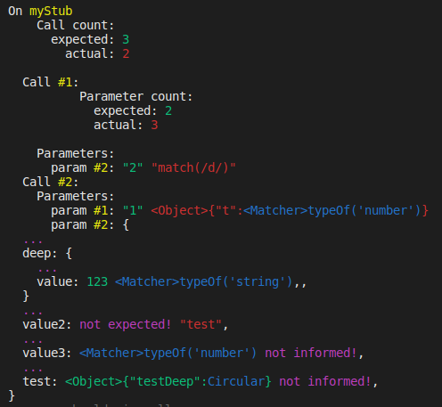

# sinon-chai-calls-assertion

[](https://github.com/Farenheith/sinon-chai-calls-assertion/actions)
[](https://github.com/Farenheith/sinon-chai-calls-assertion/actions)
[](https://github.com/Farenheith/sinon-chai-calls-assertion/actions)
[](https://codeclimate.com/github/Farenheith/sinon-chai-calls-assertion/test_coverage)
[](https://codeclimate.com/github/Farenheith/sinon-chai-calls-assertion/maintainability)
[](https://david-dm.org/Farenheith/sinon-chai-calls-assertion)
[](https://badge.fury.io/js/sinon-chai-calls-assertion)

A simple assertion to validate many aspects of stub calls. It is supposed to use with sinon + chai.

## How it works

### expect(stub).callsLike

Will validate the exactly interaction with the mocked method, which is:

- How many times has been called;
- Which parameters have been passed to it;
- In what order the calls happened.

## How to install?
```sh
npm i -D sinon-chai-calls-assertion
```

```javascript
import { callsLike } from 'sinon-chai-calls-assertion'
chai.use(callsLike)
```

## How to use?

Just pass the stub in the first parameter and, in the others, arrays with the set of parameters each calls had received.

```javascript
expect(myStub).callsLike(
  ['param1call1', 'param2call1', 'param3call1'],
  ['param1call2', 'param2call2', 'param3call2'],
 );
```

If you want to check if the stub had never been called, pass just the stub:

```javascript
expect(myStub).callsLike();
```

If you expect the stub to have been called with no parameters, pass empty arrays:

```javascript
expect(myStub).callsLike([], [], [])
```

_(in this example, myStub have been called three times with no parameters)_

You can also use sinon matchers to validate the parameters instead of exact values:

```javascript
expect(myStub).callsLike(
  [sinon.match.object, sinon.match.string, sinon.match(/.+foo.+goo/)]
 );
```

The generated log will look pretty as this:


